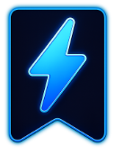

  

<h1 align="center">QuickMark</h1>

  A Chrome extension that puts your favorite websites one click away — on every page.

  
  

---

## What is QuickMark?

QuickMark is a lightweight Chrome extension that gives you instant access to your bookmarked websites from a floating widget on every webpage. No more digging through bookmark folders or opening new tabs just to reach your go-to sites.

**The idea is simple:** a small button sits on the edge of your screen. Hover over it, and your favorite sites appear. Click one, it opens in a new tab. That's it.

---

## Features

**Floating Widget**
- Small draggable button that lives on every webpage
- Hover to expand, shows your selected tools as a grid of favicons
- Drag it to any edge (left, right, bottom) — it snaps and remembers position
- Edit mode with checkboxes to pick which bookmarks appear
- Auto-detects viewport edges so the panel never clips off-screen
- Customizable opacity, colors, and size (small / medium / large)

**Bookmark Manager (Popup)**
- Two sections: Essentials and Favorites
- Drag-and-drop reordering within sections
- Drag tabs to reorder the sections themselves
- Search bar to filter favorites (appears when you have 7+)
- Add any URL as a favorite with one click
- Right-click context menu to add the current page to Favorites, Essentials, or Widget
- Widget toggle button on each tool card (hover to see it)

**Context Menu**
- Right-click any page to access QuickMark options:
  - Add to Favorites / Remove from Favorites
  - Add to Essentials / Remove from Essentials
  - Add to Widget / Remove from Widget
  - Add to Favorites + Widget (combo)
- Labels update dynamically based on current page status

**Customization**
- Pick gradient colors for the widget header
- Choose size preset (small, medium, large)
- Adjust idle opacity (10% to 100%)
- Block specific domains from showing the widget
- Show/hide the close button

**Keyboard Shortcut**
- `Alt+A` opens the QuickMark popup (customizable in Chrome settings)

**Data & Privacy**
- All data stored locally in your browser via Chrome Storage API
- Syncs across devices when signed into Chrome (falls back to local if quota exceeded)
- Export/import configuration as JSON for backup or transfer
- No external servers, no tracking, no analytics
- Zero runtime dependencies

**Security**
- HTTPS-only URLs enforced
- XSS sanitization on all user input
- Strict Content Security Policy
- No remote code execution
- No data collection

---

## Installation

### From GitHub Release

1. Download this repository (Code → Download ZIP) and extract it.
2. Unzip the file
3. Open `chrome://extensions/` in Chrome
4. Enable "Developer mode" (top right toggle)
5. Click "Load unpacked"
6. Select the `dist/` folder inside the unzipped directory

### From Chrome Web Store

Coming soon.

---

## Usage

### Getting Started

After installing, QuickMark comes pre-loaded with 9 popular tools in the Essentials section. You can:

1. **Click the QuickMark icon** in the toolbar to open the popup
2. **Browse Essentials** — pre-loaded popular tools
3. **Add Favorites** — click the `+` button or right-click any webpage
4. **Use the floating widget** — hover over the small button on any page

### Adding Sites

- **From the popup:** Switch to Favorites tab, click `+`, enter a URL
- **From any page:** Right-click → QuickMark → Add to Favorites
- **To the widget:** Right-click → QuickMark → Add to Widget

### Managing the Widget

- **Drag** the widget button to reposition it on any screen edge
- **Hover** to expand and see your tools
- **Click the pencil icon** (✎) in the widget header to enter edit mode
- **Check/uncheck** tools, then click **Done** to save
- **Right-click** a tool in the widget to remove it

### Customization

Open Settings (⚙) in the popup to:
- Toggle the floating widget on/off
- Adjust widget opacity
- Block specific domains
- Customize widget colors and size
- Change the keyboard shortcut

### Backup & Restore

In Settings → Backup & Restore:
- **Export Config** — saves all bookmarks + widget preferences as JSON
- **Import Config** — restores from a previously exported file

---

## Permissions

QuickMark requests minimal permissions:

| Permission | Why |
|---|---|
| `storage` | Save your bookmarks and settings |
| `contextMenus` | Right-click menu integration |
| `tabs` | Open links in new tabs, update context menu per page |
| `alarms` | Periodic background favicon refresh |

No access to page content. No network requests except to Google's Favicon Service for site icons.

---

## Privacy

See [PRIVACY_POLICY.md](PRIVACY_POLICY.md) for the full privacy policy.

**TL;DR:** QuickMark does not collect, transmit, or share any user data. Everything stays in your browser.

---

## License

Copyright © 2026 SoftRealms (softrealms.com). All rights reserved.

See [LICENSE](LICENSE) for details.

---

  Built by <a href="https://softrealms.com">SoftRealms</a> 
  If QuickMark saves you time, consider supporting its development ☕

---
